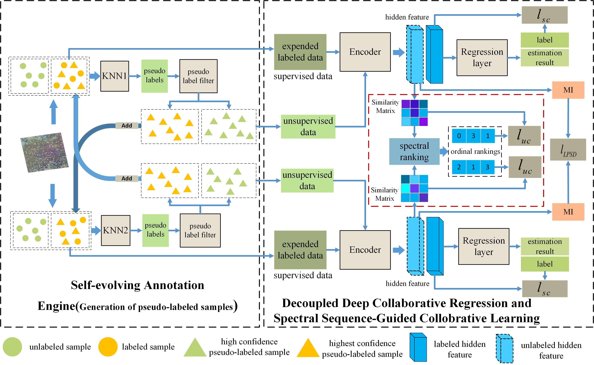

# D2-PCSSR
Data-Efficient PolSAR Image Crop Parameter Retrieval via Decoupled Deep Collaborative Regression with Spectral Sequence Guidance
---

## 👀Introduction

This repository contains the code for our paper `D2-PCSSR: Data-Efficient PolSAR Image Crop Parameter Retrieval via Decoupled Deep Collaborative Regression with Spectral Sequence Guidance`. 

## 📂 Dataset Preparation

We evaluated our method on two crop datasets collected in Hengshui, China:
*   **Winter Wheat:** LAI retrieval across three key growth stages (Booting, Heading, Grain-Filling).
*   **Summer Maize:** Plant Height retrieval across three key growth stages (Jointing, Tasseling, Grain-Filling).

*Note: Due to data sharing policies, the original PolSAR images are not publicly available. However, we provide the pre-processed feature vectors and the pseudo-label generation pipeline for full reproducibility.*

Please organize your data as follows:

## 🚀 Quick Start
1. Create environment.
  '''
  conda create -n D2PCSSR python=3.9
  conda activate D2PCSSR
  '''

2. Install all dependencies. Install pytorch, cuda and cudnn, then install other dependencies via:
  '''
  pip install -r requirements.txt
  '''

